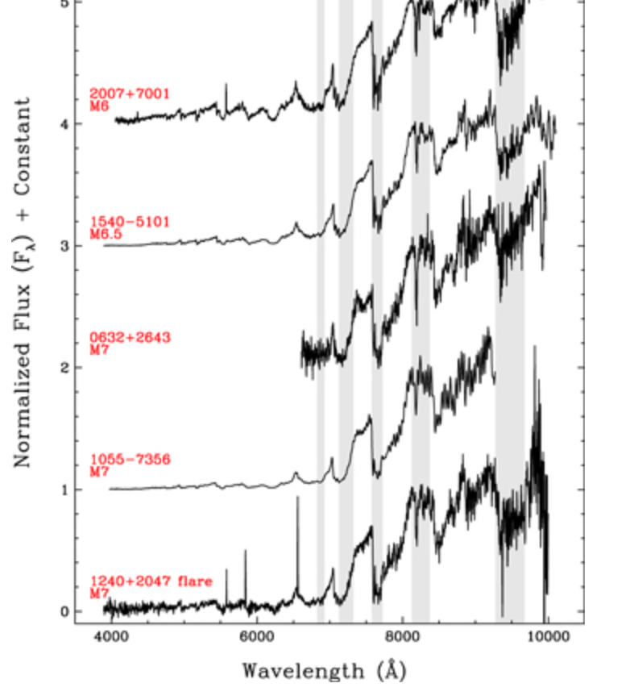
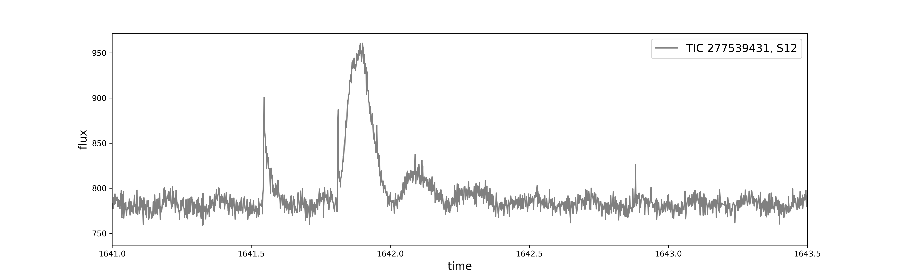
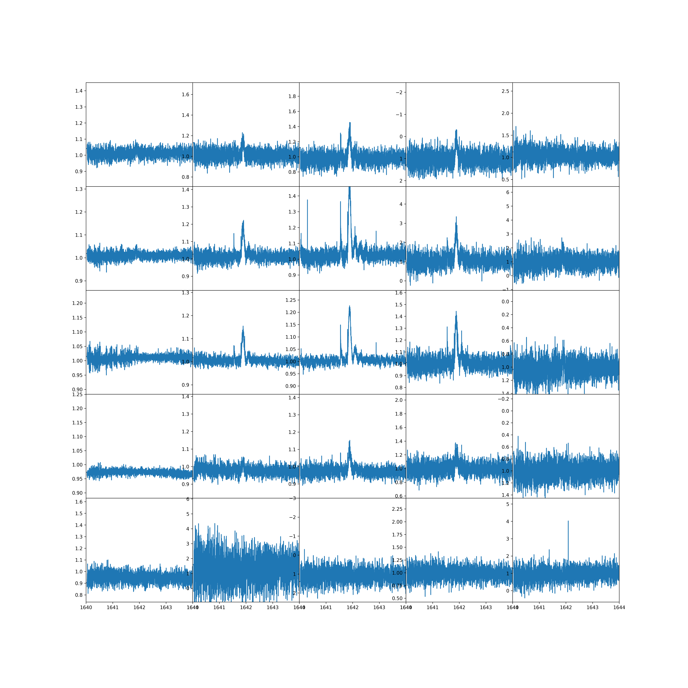
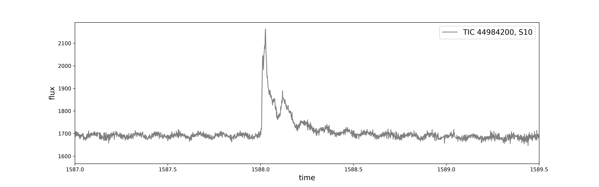
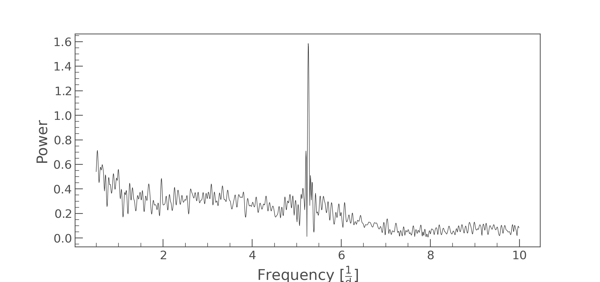
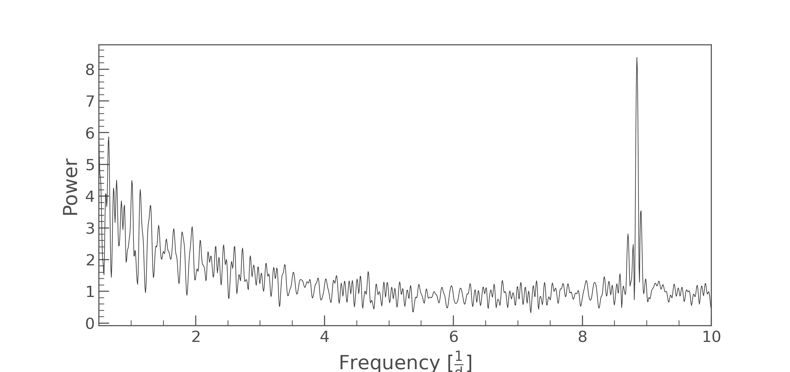
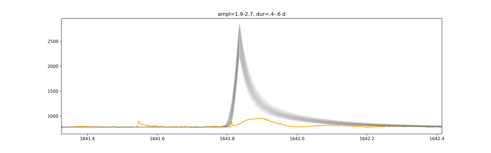
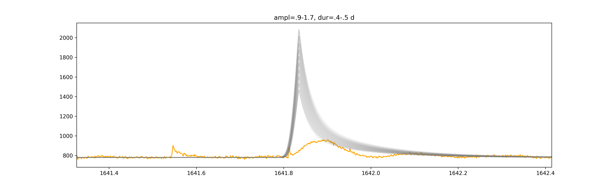

# Multiperiod flares

There are two ultra-fast rotating late M dwarfs that exhibit a large flare each that lasts more than one rotation period.

## TIC 277539431, sector 12

## TIC 44984200, sector 10

### Light curves

#### TIC 277539431

The feature really occurs on the star. It is centered in the 2nd row 3rd column.

#### TIC 44984200

Todo: sine fit

### Periodogram, sine fits

#### TIC 277539431

The dominant period is 4.6 hours.

Todo: sine fit

#### TIC 44984200

The dominant period is 2.7 hours.

Todo: sine fit

#### Questions

How large is the flux difference between hot and cool side?

### flare fits

#### TIC 277539431

#### TIC 44984200

To Do

## Model

Is the flare rotating in and out view?
We can see it on the bright side of the star. If the active region that causes the photometric modulation is cospatial with the flaring region, the active region is in total brighter than the quiescent star.

## Discussion

## Acknowledgements

Heavy use of lightkurve, including `to_periodogram`.

