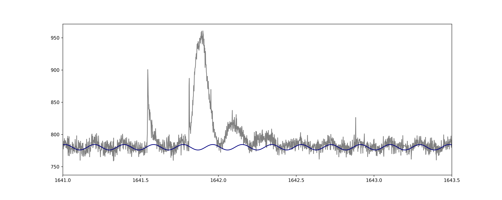
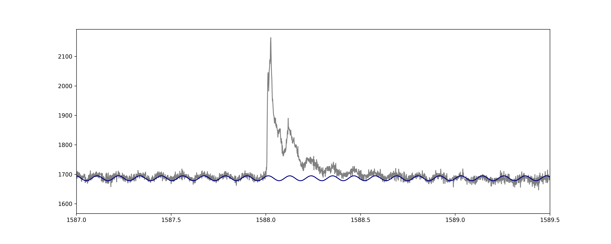
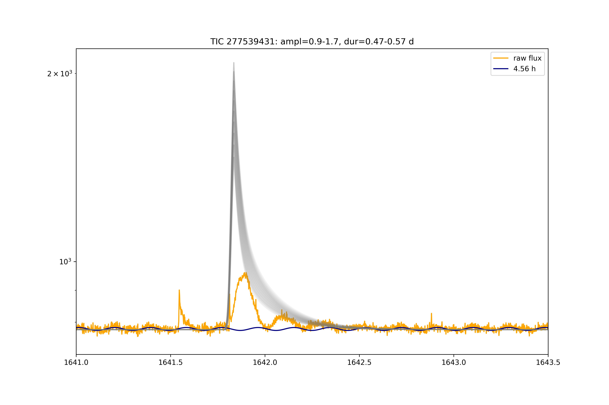
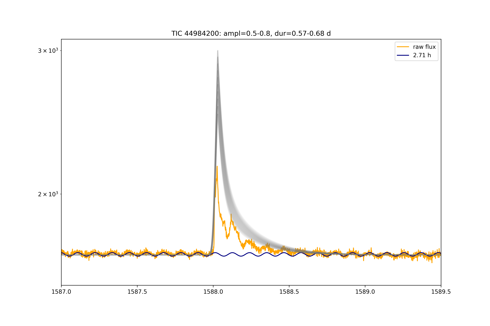

# Multiperiod flares

There are two ultra-fast rotating late M dwarfs that exhibit a large flare each that lasts more than one rotation period.

## TIC 277539431, sector 12

Modulation period: 4.56 h

Estimated ED from duration-ED relation: 18366-23989 s

Estimated ED from flare fit: 8922+/-1832 s

Relative amplitude of modulation: 5.4e-03

## TIC 44984200, sector 10

Modulation period: 2.71 h

Estimated ED from duration-ED relation: 23689-30942 s

Estimated ED from flare fit: 5302+/-843 s

Relative amplitude of modulation: 4.9e-03

### Light curves

#### TIC 277539431

The feature really occurs on the star. It is centered in the 2nd row 3rd column.

#### TIC 44984200

### Periodogram, sine fits

#### TIC 277539431

The dominant period is 4.6 hours.

#### TIC 44984200

The dominant period is 2.7 hours.

#### Questions

How large is the flux difference between hot and cool side?

### flare fits

#### TIC 277539431

#### TIC 44984200

## Discussion

Besides the giant, TIC 44984200 has only two marginal flares. TIC 277539431 shows three flares in its LC, the largest of which is preceding the giant one and has an amplitude of 15%.

### Single star with active region and flare

Is the flare rotating in and out view?
We can see it on the bright side of the star. If the active region that causes the photometric modulation is cospatial with the flaring region, the active region is in total brighter than the quiescent star.

### Eclipsing UCD binary / ultra-HJ companion

Can we rule out a companion?
If not, is it SPI?

## Acknowledgements

Heavy use of lightkurve, including `to_periodogram`, also `scipy.optimize`.

